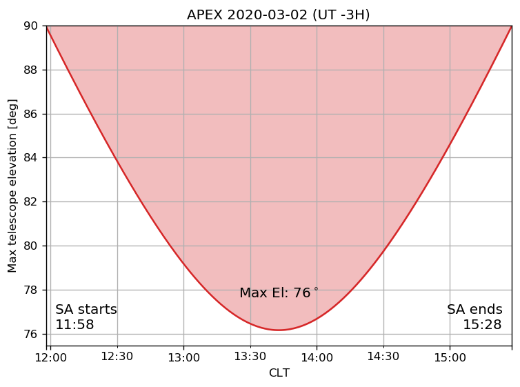

# apex-sun-avoidance
Plot maximum telescope elevation for a given UT date. By default the script displays the result for the current UT date and get the time offset for CLT from https://www.timeanddate.com/time/zone/chile. If using the script for other date than the current be aware of the Chilean daylight savings time (UT offset).


## Help
```bash
$ python show_sun_avoidance.py -h                                                                                           
usage: show_sun_avoidance.py [-h] [-o OFFSET] [date]

positional arguments:
  date                  Date (2017-10-10)

optional arguments:
  -h, --help            show this help message and exit
  -o OFFSET, --offset OFFSET
                        UT offset e.g. -3, default from www.timeanddate.com
```

## Example
```bash
$ python show_sun_avoidance.py 2020-03-02 -o -3                                                                             
 - Using CLT: UTC -3H
Figure saved to: plots/maxEl_2020-03-02.png

UTC sun avoidance 14:58 - 18:28
CLT sun avoidance 11:58 - 15:28
Max elevation 76 degrees
```

